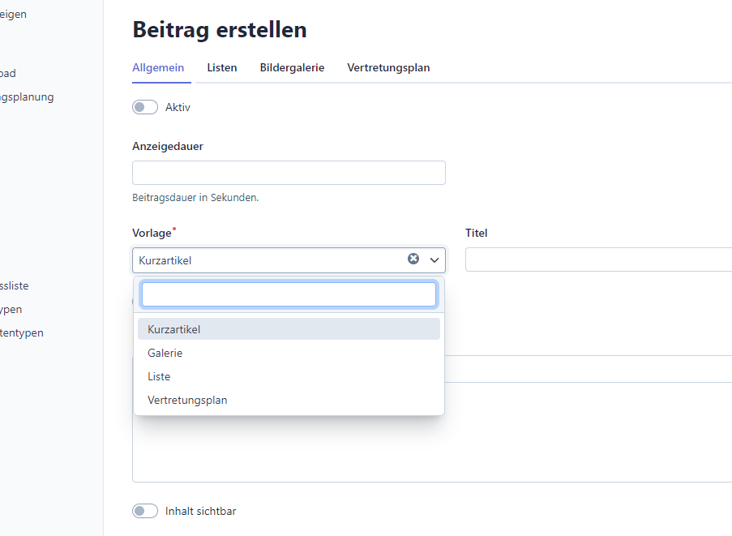
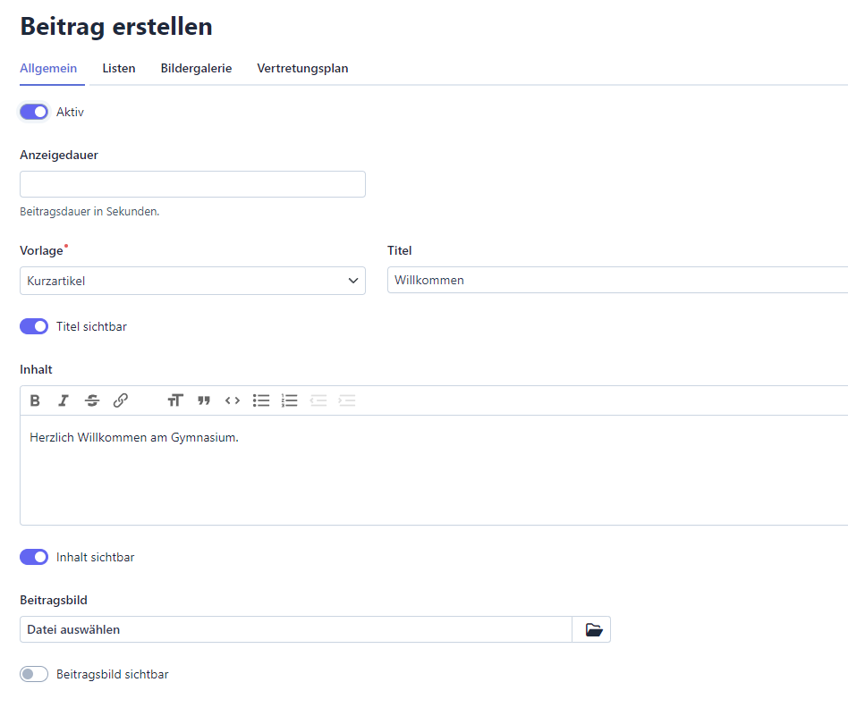

# Kurzartikel erstellen

## Schritt 1

Klicken Sie auf "Beitrag erstellen" und wählen unter "Vorlage" den Eintrag "Kurzartikel".

## Schritt 2

Geben Sie einen Titel und den Inhalt ein. Aktivieren Sie außerdem die jeweilige
Sichtbarkeit. Vergessen Sie nicht, den Beitrag abschließend aktiv zu schalten.
Optional können Sie auch ein Beitragsbild ergänzen. Nutzen Sie dafür möglichst
Bilder im Hochkantformat.

Klicken Sie abschließend auf "Erstellen", um die Arbeit zu speichern.

