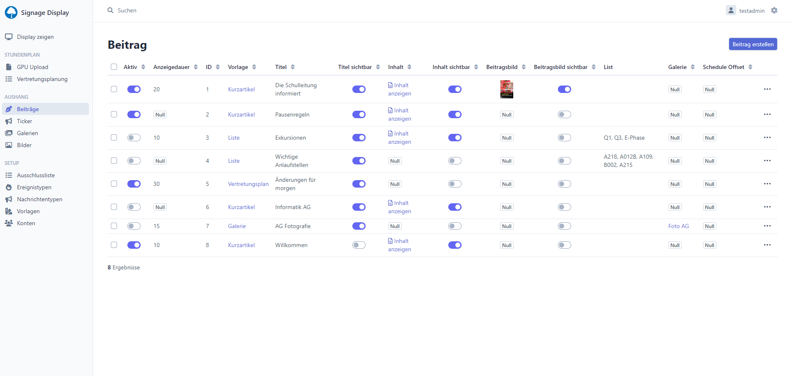
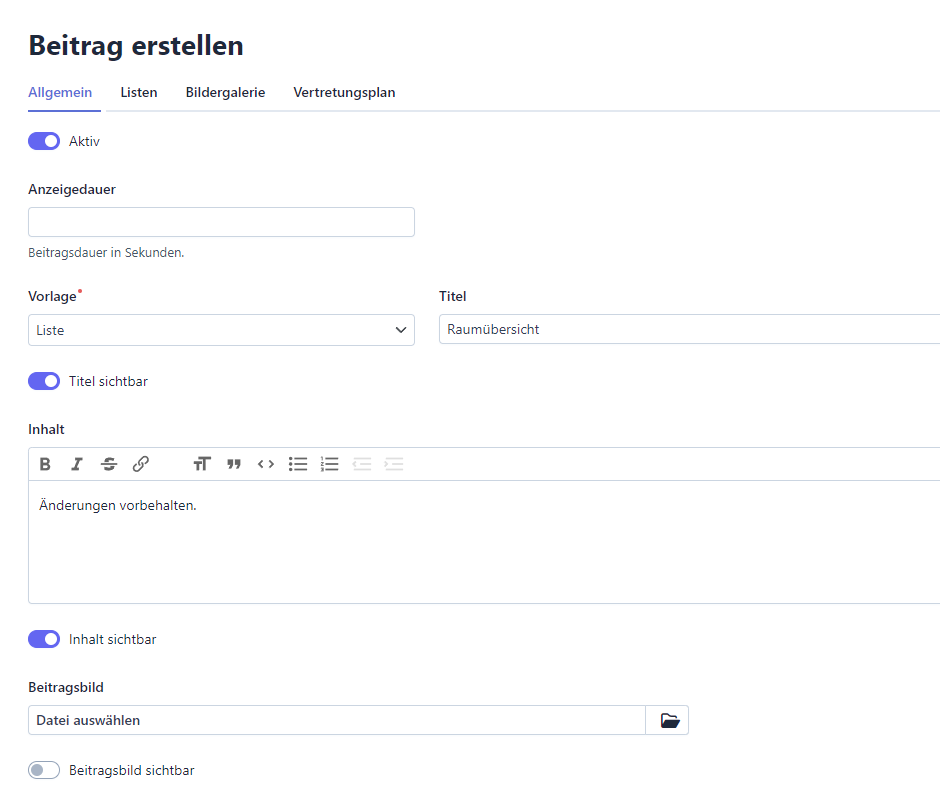
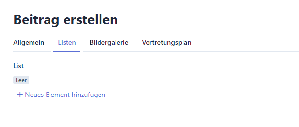
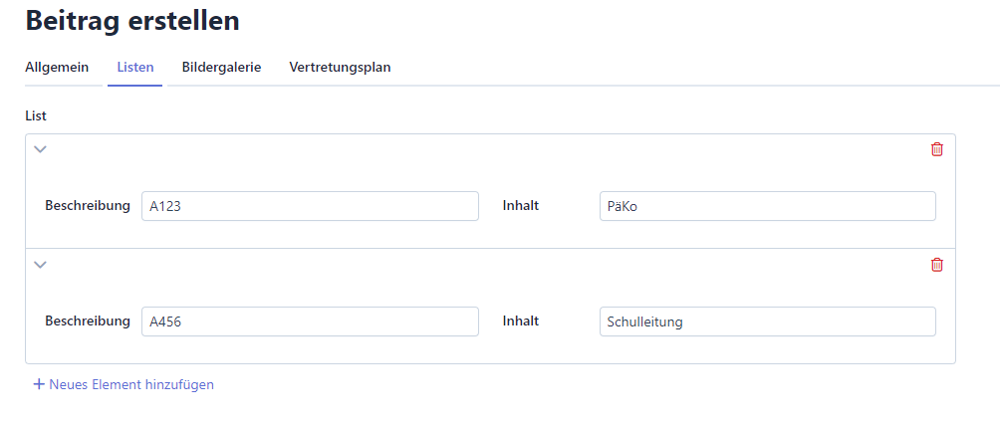
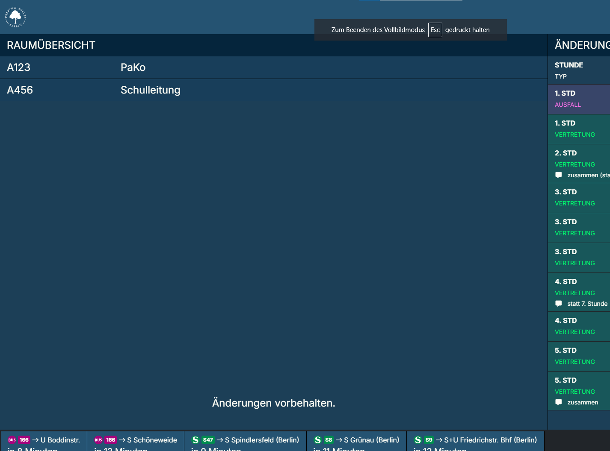

# Liste erstellen

## Schritt 1

Klicken Sie auf "Beitrag erstellen" und wählen unter "Vorlage" den Eintrag "Liste".

Geben Sie einen Titel ein. Optional können Sie einen Text unter "Inhalt" verfassen,
der an der unteren Kante der Anzeige erscheint. Nutzen Sie möglichst nur einzeilige Texte.

## Schritt 2

Wechseln Sie in den Reiter "Listen" und klicken Sie auf "Neues Element hinzufügen":

## Schritt 3

Fügen sie einige Listeneinträge hinzu:

## Schritt 4

Speichern Sie Ihre Arbeit durch Klicken auf "Erstellen"

## Ergebnis

