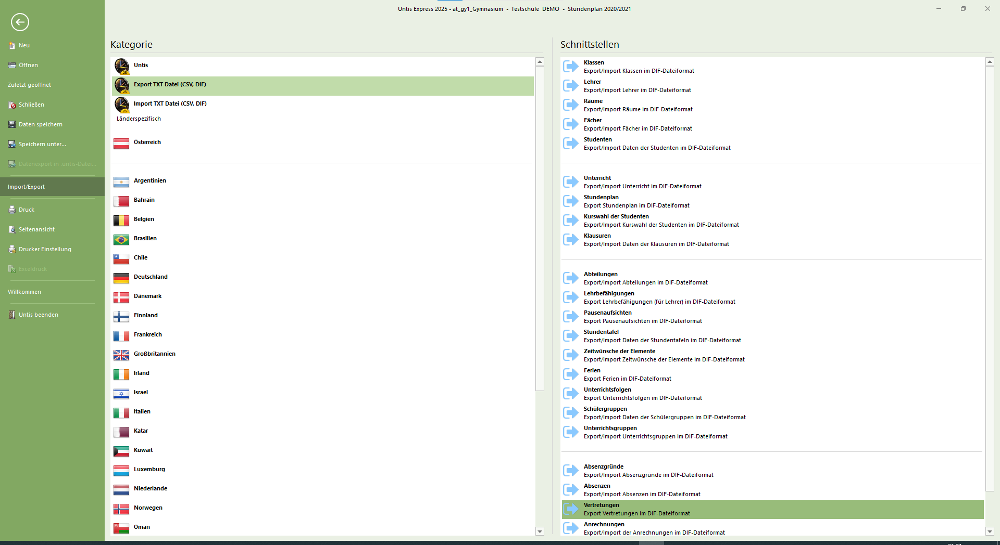
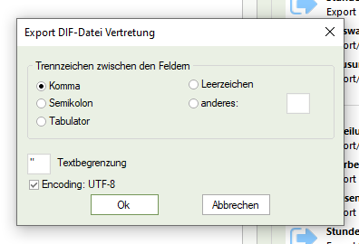
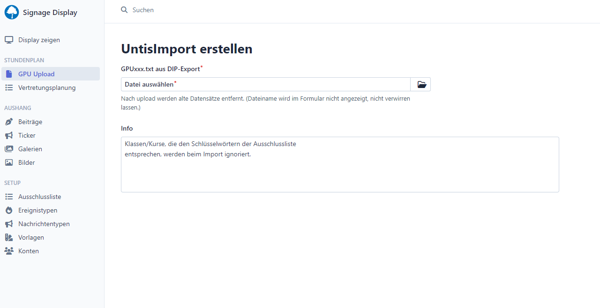

# Export der DIF-Datei

Wählen Sie in der Vertretungsansicht unter dem Menüpunkt
"Datei" → "Impoprt/Export" → "Export TXT-Datei (CSV/DIF)" → "Vertretungen"

Stellen Sie beim Export folgende Optionen ein:

1. Trennzeichen: Komma
2. Häkchen bei: Encoding UTF-8

Die erzeugte Datei (GPU014.TXT) kann über den GPU-Upload importiert werden.

